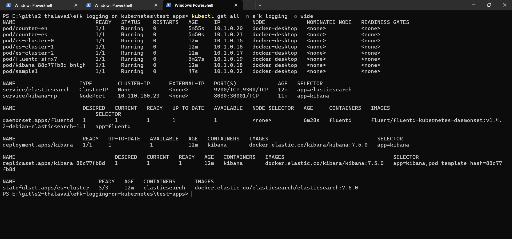
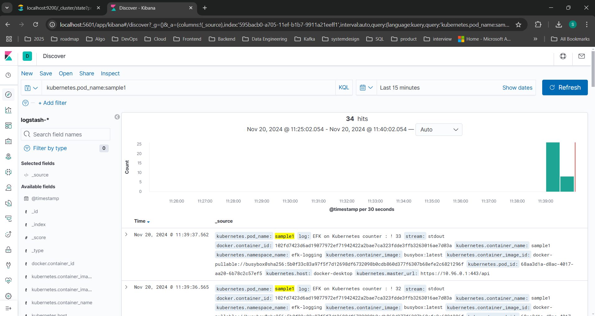

# EFK Setup on Kubernetes

## install Elastic Search Cluster

## Install Kibana

## Install FluentD

## test application Logs Filtering

Kibana Search Filters for K8s Pod

        kubernetes.pod_name:counter-en

        kubernetes.pod_name:counter-es

        kubernetes.pod_name:counter

